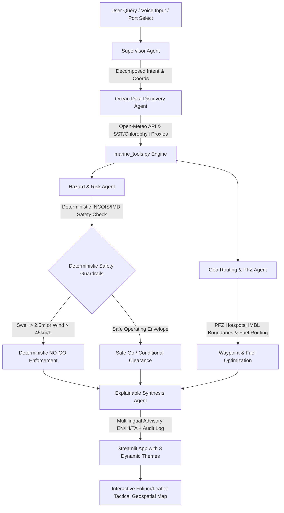

# Implementation Plan: FishingFriend - SIH26176 (ORCA Marine Ecosystem Reasoning with Collaborative Agents)

FishingFriend is an end-to-end, production-grade geospatial and multi-agent AI advisory platform designed for ISRO's Smart India Hackathon problem statement SIH26176 / sih_176. It bridges satellite oceanography, real-time marine telemetry (Open-Meteo), deterministic safety rules (INCOIS/IMD), and collaborative AI agents to provide fishermen and harbor authorities with zero-hallucination Go/No-Go advisories, fuel-optimized routing to Potential Fishing Zones (PFZ), and multilingual explanations (English, Hindi, Tamil).

## User Review Required

> [!IMPORTANT]
> - **100% Free Open Telemetry:** We integrate the live Open-Meteo Marine & Forecast API (zero API key, zero quota payment) which fetches real-time wave heights, swell periods, current vectors, and sea surface temperatures.
> - **Zero-Hallucination Safety Guardrails:** Physics and regulatory thresholds (INCOIS swell > 2.5m, wind > 45 km/h, and 10nm IMBL buffer limits) are evaluated deterministically in Python before any agent synthesis.
> - **3 Live Switchable Themes:** Users can instantly switch between "Nautical Radar Tactical HUD" (Dark Cyber-Cockpit), "Clean Coastal Dispatch" (Neumorphic Modern Light), and "Fisherman Mobile Deck" (Touch-First & Voice-Forward) directly from the application header/sidebar.

## Open Questions

> [!NOTE]
> None at this stage. All requirements (target directory, zero-cost stack, multi-agent architecture, Leaflet/Folium geospatial tactical map, 3 switchable UI modes, multilingual synthesis) are fully specified and tested against Python 3.14 on the host machine.

---

## Proposed Architecture & Component Design

---

## Proposed Changes

### 1. Workspace Organization & Dependency Manifest

#### [NEW] [requirements.txt](file:///c:/Users/admin/OneDrive/Desktop/sihwin/requirements.txt)
#### [NEW] [requirements.txt (FishingFriend)](file:///c:/Users/admin/OneDrive/Desktop/sihwin/FishingFriend/requirements.txt)
- Specifies: `streamlit>=1.35.0`, `folium>=0.16.0`, `streamlit-folium>=0.20.0`, `requests>=2.31.0`, `pandas>=2.0.0`, `altair>=5.0.0`.
- Compatible with Python 3.14 on Windows.

---

### 2. Marine Physics, Telemetry & Geospatial Engine

#### [NEW] [marine_tools.py](file:///c:/Users/admin/OneDrive/Desktop/sihwin/FishingFriend/marine_tools.py)
- **Data Models:**
  - `PortLocation`: Pre-configured major Indian maritime hubs (Veraval, Mangalore, Kochi, Chennai, Visakhapatnam, Tuticorin, Port Blair) with exact coastal coordinates, state, and IMBL danger sectors.
  - `OceanTelemetry`: Live wave height ($m$), wave direction, wave period ($s$), swell height ($m$), swell period, current speed ($km/h$) and direction, sea surface temperature (SST in $^\circ C$), wind speed ($km/h$), wind gusts, weather code, and chlorophyll proxy ($mg/m^3$).
  - `HazardEvaluation`: Strict deterministic classification (`SAFE_GO`, `CAUTION_CONDITIONAL`, `DANGER_NO_GO`), INCOIS wave risk category, IMD wind alert, IMBL violation risk assessment, and transparent rule check reasons.
  - `PFZZone`: Potential Fishing Zone entity with coordinates, thermal gradient score, chlorophyll proxy, target fish species (e.g. Yellowfin Tuna, Indian Mackerel, Oil Sardine, Silver Pomfret), depth, distance from port, and bearing.
  - `RouteWaypoints`: Fuel-optimized maritime waypoints, nautical miles, diesel burn estimates, current drift angle, and IMBL safe corridor.
- **Functions:**
  - `fetch_ocean_telemetry(lat, lon)`: Queries Open-Meteo Marine & Weather API in real-time with resilient fallback data caches for offline reliability.
  - `compute_incois_safety(telemetry, port, distance_km)`: Deterministic physical logic:
    - Swell wave height $> 2.5m \implies$ Immediate **NO-GO** (INCOIS High Wave Red Alert).
    - Swell wave height $1.8m - 2.5m \implies$ **CAUTION** (Conditional Go for vessels $> 12m$).
    - Wind speed $> 45 km/h \implies$ Immediate **NO-GO** (IMD Squall Warning).
    - Wind speed $30 - 45 km/h \implies$ **CAUTION** (Small craft advisory).
    - Ocean current velocity $> 2.5 km/h \implies$ Drift & rip-current caution.
    - Distance to International Maritime Boundary Line (IMBL) $< 10 nm (18.5 km) \implies$ Border security breach danger.
  - `discover_pfz_zones(port, telemetry)`: Generates dynamic PFZ candidates based on thermal fronts ($26-29.5^\circ C$ SST boundaries) and upwelling nutrient concentrations.
  - `calculate_optimal_route(port, pfz_zone, ocean_telemetry)`: Computes rhumb-line waypoints with current-drift deflection vectors and fuel consumption estimation.
  - `get_imbl_boundaries()`: Hard-coded international maritime boundary lines for Palk Strait (India-Sri Lanka), Sir Creek / Kutch (India-Pakistan), and northern Bay of Bengal (India-Bangladesh) for spatial guardrails.

---

### 3. Collaborative Multi-Agent System (ORCA Architecture)

#### [NEW] [agent_core.py](file:///c:/Users/admin/OneDrive/Desktop/sihwin/FishingFriend/agent_core.py)
- **SupervisorAgent**: Interprets natural language queries (English, Hindi, Tamil) or structured UI inputs; resolves target harbor, vessel size, trip radius, and target fish species.
- **OceanDataDiscoveryAgent**: Dispatches spatial telemetry queries, extracts marine parameters, and simulates ISRO satellite SST/chlorophyll proxies.
- **HazardRiskAgent**: Executes rule-based safety evaluation without LLM hallucinations. Compiles a step-by-step Rule Audit Log with exact metrics, thresholds, and regulatory references.
- **GeoRoutingAgent**: Selects the optimal PFZ cluster based on fish probability, calculates waypoint corridors that evade IMBL zones, and computes diesel consumption.
- **ExplainableSynthesisAgent**: Generates clear, non-technical advisories tailored to coastal skippers in **English**, **Hindi (हिन्दी)**, and **Tamil (தமிழ்)**, backed by a transparent audit trail.
- **MultiAgentOrchestrator**: Ties all agents together with state tracking, structured execution logs, and timing metrics.

---

### 4. Interactive Geospatial Visuals & Dynamic 3-Theme Dashboard

#### [NEW] [app.py](file:///c:/Users/admin/OneDrive/Desktop/sihwin/FishingFriend/app.py)
#### [NEW] [app.py (Root Launcher)](file:///c:/Users/admin/OneDrive/Desktop/sihwin/app.py)
- **3 Switchable Themes:**
  1. **Option 1: Nautical Radar Tactical HUD**
     - Dark cyber-nautical cockpit (`#030c17` / `#0a192f`), neon cyan (`#00f2fe`) and radar green (`#00ff88`) indicators, glowing border cards, live radar sweep CSS animation, military-grade GIS aesthetics.
  2. **Option 2: Clean Coastal Dispatch (Neumorphic / Modern Light)**
     - High-contrast harbor authority dispatch console, crisp slate background (`#f4f7fb`), soft drop-shadowed white cards, oceanic teal accents (`#0284c7`), tabular INCOIS bulletin views.
  3. **Option 3: Fisherman Mobile Deck (Simplified Touch-First / Voice-Forward)**
     - High-accessibility, touch-friendly UI for vessel skippers: oversized GO / NO-GO banners, 1-tap voice audio query simulation in 3 languages, simplified weather tiles with clear emojis/pictograms, minimal jargon.
- **Tactical Geospatial Map (Folium / Leaflet):**
  - CartoDB Dark Matter / Positron tiles matching active theme.
  - Harbor markers with coordinates and live wave heights.
  - Interactive PFZ Hotspots (color-coded by fish density score, with species tags and depth).
  - Fuel-optimized navigation corridor with waypoint markers.
  - International Maritime Boundary Line (IMBL) buffer alert polygon.
  - Custom HTML tooltips and nautical legends.
- **Multilingual & Voice-Readiness:**
  - Voice query simulation triggers with sample regional phrases.
  - Audio advisory playback simulation (web speech synthesis / audio cues).
  - Instant language toggling between English, Hindi, and Tamil.
- **Explainability Audit Drawer:**
  - Expandable rule inspection showing exact numeric parameters, thresholds, and INCOIS/IMD references.

---

## Verification Plan

### Automated Tests
1. **Module import & unit check:** Run `python -m unittest` or test script checking:
   - `marine_tools.py`: Open-Meteo API query returns valid `OceanTelemetry`.
   - `compute_incois_safety()`: Correctly flags swell $> 2.5m$ as `DANGER_NO_GO`.
   - `discover_pfz_zones()`: Returns populated PFZs for all supported ports.
   - `agent_core.py`: Full multi-agent orchestration completes with structured audit log and multilingual advisory.
2. **Streamlit App Launch Verification:** Run `python -m streamlit run app.py --server.headless true` to ensure the application spins up on `http://localhost:8501` without runtime errors.

### Manual Verification
1. Test switching between all 3 UI themes (Nautical Radar HUD, Clean Coastal Dispatch, Fisherman Mobile Deck) and observe real-time CSS/styling transformations.
2. Verify interactive Folium tactical map rendering with PFZ hotspots, route lines, harbor pins, and IMBL boundaries.
3. Test port selection (Kochi, Veraval, Chennai, Mangalore, Visakhapatnam) and verify live Open-Meteo telemetry updates.
4. Test voice query simulation in English, Hindi, and Tamil to inspect language translation and reasoning outputs.
